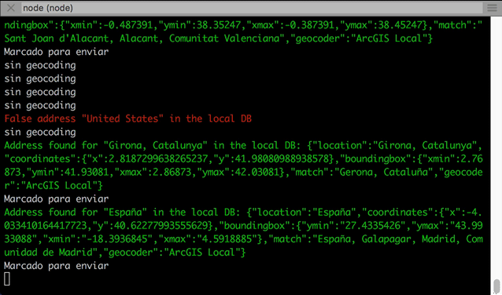

# twitter-rt-service

Este script se conecta a la [Stream API de Twitter](https://developer.twitter.com/en/docs) para recibir tweets en tiempo real e intentar geocodificarlos. Si lo consigue los envía a la dirección indicada por la variable `WS_URL` del fichero `emitter.js` (por defecto lo envía a `'ws://localhost:8888'`).

> **Relacionado**: Este proyecto en combinación con [arcgis_websocket_server](https://github.com/esri-es/arcgis_websocket_server) permite servir estos datos haciéndose pasar por Stream Layer, y por tanto cargar los tweets en tiempo real en un webmap/webscene y/ cualquier<sup>1</sup> SDK/API de ArcGIS (<sup>1</sup> se ha detectado alguna [limitación](https://github.com/hhkaos/arcgis_websocket_server#known-issues)).



Y la información enviada tiene un aspecto similar a este:

```
{
  "username": "Jurado",
  "screename": "Jurado___",
  "text": "@Morfeiu @edugalan En ningún momento dice que el motivo sea exclusivo. Que haya gente como tú que vea xenofobia en… https://t.co/nkAK1NPNzQ",
  "profile_image_url_https": "https://pbs.twimg.com/profile_images/954418199805726721/LZaAP2qG_normal.jpg",
  "geo": null,
  "location": "Comunidad de Madrid, España",
  "created_at": "Fri Apr 26 16:24:30 +0000 2019",
  "id_str": "1121812304071413761",
  "reply_count": 0,
  "retweet_count": 0,
  "favorite_count": 0,
  "tweet_url": "https://twitter.com/Jurado___/status/1121812304071413761",
  "is_rt": false,
  "lat": 40.3991990891055,
  "lon": -3.681170514432476
}
```

## Instalación

Para instalar sólo es necesario ejecutar tener NodeJS instalado y ejecutar desde el directorio raíz del proyecto: `$ npm install`

## Configuración y ejecución

1. Crear un fichero de configuración llamado `config/twitter_credentials.json`
```
{
  "consumer_key": "YOUR_CONSUMER_KEY",
  "consumer_secret": "YOUR_CONSUMER_SECRET",
  "token": "YOUR_TOKEN",
  "token_secret": "YOUR_TOKEN_SECRET"
}
```

E introduce los valores de una Twitter app (esta puedes crearla en [dev.twitter.com](https://developer.twitter.com/en/apps))

> También puedes configurar los geocodificacodes modificando el fichero **[src/geocoders.js](./src/geocoders.js)**:

2. Edita el fichero `config/elections.json` a tu gusto. Esta es la configuración que viene por defecto:

```
{
 "words" : {
    "pp": [
      "PP",
      "pablocasado_",
      "Casado",
      "ppopular"
    ],
    "psoe": [
      "PSOE",
      "sanchezcastejon",
      "Sanchez"
    ],
    "podemos": [
      "Podemos",
      "pablo_iglesias_",
      "ahorapodemos"
    ],
    "ciudadanos": [
      "Ciudadanos",
      "Albert_Rivera",
      "Rivera",
      "ciudadanoscs"
    ],
    "vox": [
      "VOX",
      "santi_abascal",
      "Abascal",
      "vox_es"
    ]
  },
  "ws" : {
    "host" : "localhost",
    "port" : 8888,
    "protocol" : "ws"
  }
}
```

3. Edita a tu gusto en init, la lista de **geocoders** . Por defecto están ["arcgis", "osm"]

4. Abre un terminal nuevo y levanta un servidor de websockets que escuche en el puerto que has configurado en `config/elections.json`. Puedes usar [websocat](https://github.com/vi/websocat) para ello:

```bash
websocat -E -t ws-l:127.0.0.1:8888 broadcast:mirror:
```

5. Por último, para la iniciar el script tan sólo es necesario ejecutar desde la consola de comandos:

`$ node emitter.js "PP,PSOE,CIUDADANOS,PODEMOS,VOX"`

> Nota: <geocoder> puede contener el valor `name` de cualquiera de los geocodificadores de src/external_geocoders.js (nominatim, arcgis, arcgisGlobal)

Donde el segundo parámetro el un hashtag o varios separados por comas.

## Cómo geolocaliza los tweets

A grandes rasgos el procedimiento que sigue este servicio es:

1.- Geocodifica la cadena de texto que el usuario tenga en el campo "location"
2.- Para evitar que los puntos con la misma cadena o mismo resultado de geocodificación se superpongan se introduce un valor aleatorio controlando que caiga dentro del boundingbox devuelto por el geocodificador
3.- Se comprueba que el punto se encuentre dentro de territorio Español, para ello se utiliza la capa simplificada [spain-boundaries.json](./data/spain-boundaries.json) que se puede ver en [http://geojson.io](http://geojson.io).

### Mejorar la precisión de la geocodificación

El fichero data/db.json contiene información de las geocodificaciones ya resueltas. Si se detecta que algún fallo importante se puede modificar manualmente el fichero db.json

Con este script podrás ver gráficamente el boundingbox de una geocodificación para decidir si cambiarlo:
https://jsbin.com/qaxujob/1/edit?html,output

Recuerda que además de cambiar el valor del boundingbox por el nuevo (más preciso) también debes cambiar los valores:

```js
"match": "Spain", <- la ubicación con la que ha matcheado
"geocoder": "OSM" <- el geocodificador que hayas usado
```
